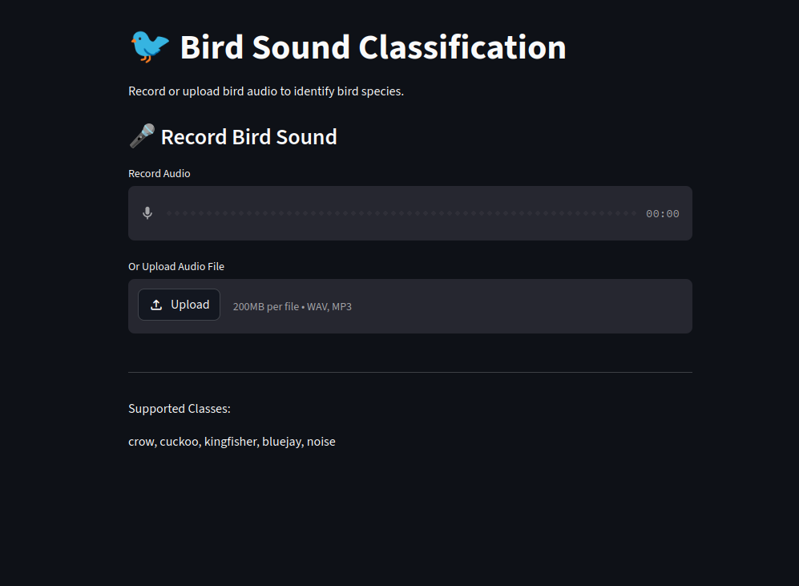

# Bird Sound Classification: Crow vs. Other Birds Using MFCC and SVM 

This project focuses on the classification of bird vocalizations (Crow, Cuckoo, Kingfisher, Bluejay, and Background Noise) using classical Machine Learning techniques. By extracting acoustic features like MFCCs and training a Support Vector Machine (SVM), the model can identify species from short audio clips.

## 👥 Team Members & Course Details
*   **Team Members:** Ben Flis Ziya, Thanha Noorudheen, Aleena V J
*   **Course:** Predictive Analytics
*   **Instructor:** Dr. Aswin VS
*   **Institution:** Digital University Kerala

## 🎯 Problem Statement & Motivation
Manual identification of bird species in the wild is labor-intensive and requires expert knowledge. Bio-acoustic monitoring provides a non-invasive way to track biodiversity. 
**Objective:** To develop a robust, lightweight classification system that uses digital signal processing (DSP) and classical ML to distinguish specific bird calls from environmental noise without the computational overhead of Deep Learning.

## 📊 Dataset Description
*   **Source:** Audio files sourced from Xeno-Canto and Kaggle Bio-acoustic datasets.
*   **Size:** 347 total audio samples.
*   **Classes:** 5 (Bluejay, Crow, Cuckoo, Kingfisher, and Noise).
*   **Features:** 140 statistical features derived from:
    *   **MFCC (20 coefficients):** Captures the spectral envelope.
    *   **Spectral Centroid:** Indicates where the "center of mass" of the spectrum is.
    *   **Spectral Rolloff:** Measure of the shape of the power spectrum.
    *   **Zero Crossing Rate:** Rate of sign-changes in the signal (helps detect noisiness).
    *   **Chroma STFT:** Relates to the 12 different pitch classes.
*   **Aggregation:** Mean, Standard Deviation, Minimum, and Maximum calculated for each feature.

## ⚙️ Methodology (Data Science Life Cycle)
1.  **Problem Definition:** Defined the scope of bird species and acoustic boundaries.
2.  **Data Collection:** Gathered `.wav` and `.mp3` files across 5 categories.
3.  **Preprocessing:** Audio loaded at 22,050Hz, normalized, and trimmed/padded to 5 seconds.
4.  **EDA:** Visualized waveforms and frequency distributions to identify patterns in bird calls.
5.  **Feature Engineering:** Used `Librosa` to extract MFCCs and spectral features; flattened into a 140-dimension vector.
6.  **Model Building:** Implemented SVM (RBF Kernel), KNN, and Random Forest.
7.  **Evaluation:** Used Accuracy, F1-Score, and Confusion Matrices to compare models.
8.  **Interpretation:** Analyzed feature importance; found MFCCs to be the primary discriminators.
9.  **Deployment:** Created a Streamlit Web App for real-time file upload and prediction.
10. **Documentation:** Finalized GitHub Repository and Technical PPT.

## 🏆 Results & Evaluation
The **SVM Classifier** outperformed other models:

| Model | Accuracy | Macro F1-Score |
| :--- | :--- | :--- |
| **SVM (RBF)** | **81.4%** | **0.81** |
| Random Forest | 77.1% | 0.75 |
| KNN | 74.2% | 0.72 |

**Key Finding:** The model showed 100% precision in identifying "Noise," ensuring that environmental sounds are not falsely classified as birds.

## 🚀 Deployment
The application is live on Streamlit Community Cloud.
*   **Live Link:** https://bird-sound-classification-mqczgejumcx4e5u7sxb5jt.streamlit.app/

### App Features:
*   **Audio Upload:** Supports .wav and .mp3.
*   **Instant Prediction:** Displays the identified species name.
*   **User Interface:** Simple, intuitive design for bird enthusiasts.



## 💻 Local Setup Instructions
1. **Clone the repo:**
   ```bash
   git clone https://github.com/Halfozar/Bird-Sound-Classification
   cd bird-sound-classification
